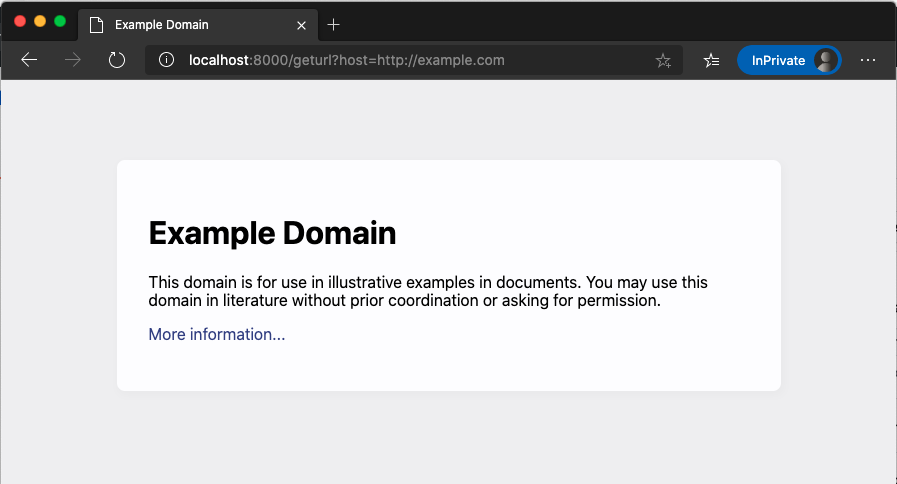

# k8s-hlab

## Install Virtual Env and Install need package
```bash
python3 -m venv venv

source venv/bin/activate

pip install -r requirements.txt 
```

## Run in python 
```bash
python app-k8s.py
```

## Example on browser
```bash
http://localhost:8000/geturl?host=http://example.com
```
